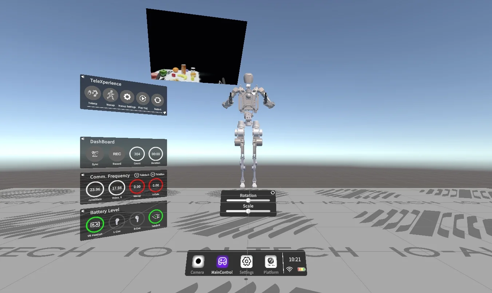
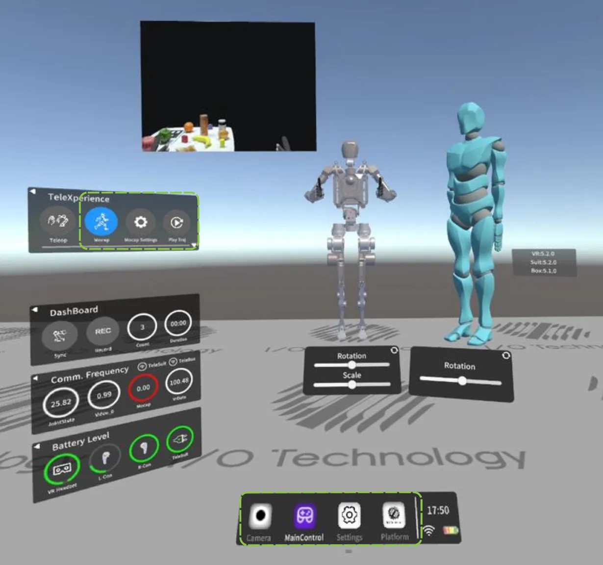

# 华苏机器人仿真平台

## 仿真场景展示

以下图片展示了机器人在不同仿真场景下的运行效果，覆盖模型展示、主控采集和多对象交互等典型使用场景。

### 机器人模型仿真


机器人模型在基础仿真环境中的展示效果，可用于观察机器人结构、姿态和模型缩放状态。

### 主控采集场景



机器人在主控面板中的仿真运行场景，支持查看采集状态、通信频率、电量状态和操作控制信息。

### 多对象交互场景



机器人在包含虚拟对象和操作界面的仿真场景中运行，可用于验证不同对象、不同任务环境下的交互流程。

---

## 环境要求

| 依赖 | 版本 |
|------|------|
| Python | 3.10+ |
| Node.js | 18+ |
| MySQL | 8.0 |
| Redis | 7+ |

---

## Howso Navigation Algorithms（华苏导航算法）

项目已在 `algorithms/howso_navigation_algorithms` 中加入 Howso Navigation Algorithms（华苏导航算法）参考模块。

当前包含 Smac Planner、Theta*、NavFn、MPPI Controller、Regulated Pure Pursuit Controller、Costmap 2D 以及相关接口与消息包。详细说明见 `algorithms/howso_navigation_algorithms/README.md`。

---

## 后端启动

### 1. 进入后端目录

```bash
cd embodied-collect-backend
```

### 2. 安装依赖

```bash
pip install -r requirements.txt
```

### 3. 配置环境变量

```bash
cp .env.example .env
```

按需修改 `.env` 中的数据库连接信息：

```env
MYSQL_HOST=127.0.0.1
MYSQL_PORT=3306
MYSQL_USER=root
MYSQL_PASSWORD=123456
MYSQL_DB=embodied_collect
REDIS_URL=redis://127.0.0.1:6379/0
```

### 4. 初始化数据库

确保 MySQL 已启动，并执行初始化 SQL：

```bash
mysql -u root -p embodied_collect < ../init.sql
```

### 5. 启动后端服务

**Windows (PowerShell)：**
```powershell
$env:PYTHONPATH = "."; python -m uvicorn main:app --host 0.0.0.0 --port 8000 --reload
```

**Linux / macOS：**
```bash
PYTHONPATH=. python -m uvicorn main:app --host 0.0.0.0 --port 8000 --reload
```

启动成功后访问：
- API 服务：http://localhost:8000
- 接口文档：http://localhost:8000/docs

### 默认账号

| 用户名 | 密码 |
|--------|------|
| admin | admin123 |

---

## 前端启动

### 1. 进入前端目录

```bash
cd embodied-collect-frontend
```

### 2. 安装依赖

```bash
npm install
```

### 3. 配置后端地址

编辑 `.env.development`，将后端地址改为实际 IP：

```env
VITE_API_BASE_URL=http://192.168.0.157:8000
```

### 4. 启动开发服务器

```bash
npm run dev
```

启动成功后访问：http://localhost:5173

---

## 同时启动前后端（快速启动）

打开两个终端分别执行：

**终端 1（后端）：**
```powershell
cd embodied-collect-backend
$env:PYTHONPATH = "."; python -m uvicorn main:app --host 0.0.0.0 --port 8000 --reload
```

**终端 2（前端）：**
```bash
cd embodied-collect-frontend
npm run dev
```

---

## 常见问题

**Q：登录报 Network Error**  
A：后端未启动，或 `.env.development` 中的 `VITE_API_BASE_URL` 地址不正确。

**Q：登录报 password cannot be longer than 72 bytes**  
A：bcrypt 版本不兼容，执行 `pip install bcrypt==4.0.1` 后重启后端。

**Q：数据库连接失败**  
A：检查 MySQL 是否启动，`.env` 中的用户名密码是否正确。
