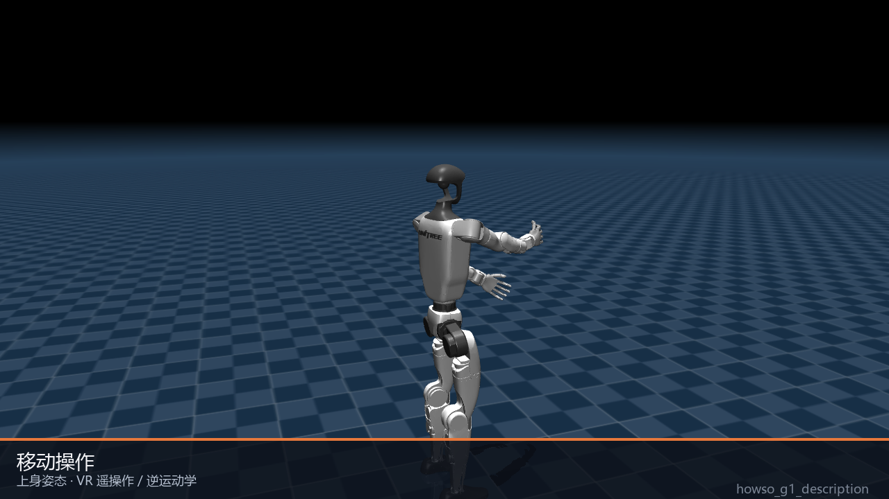
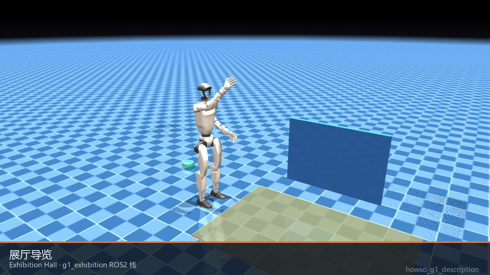
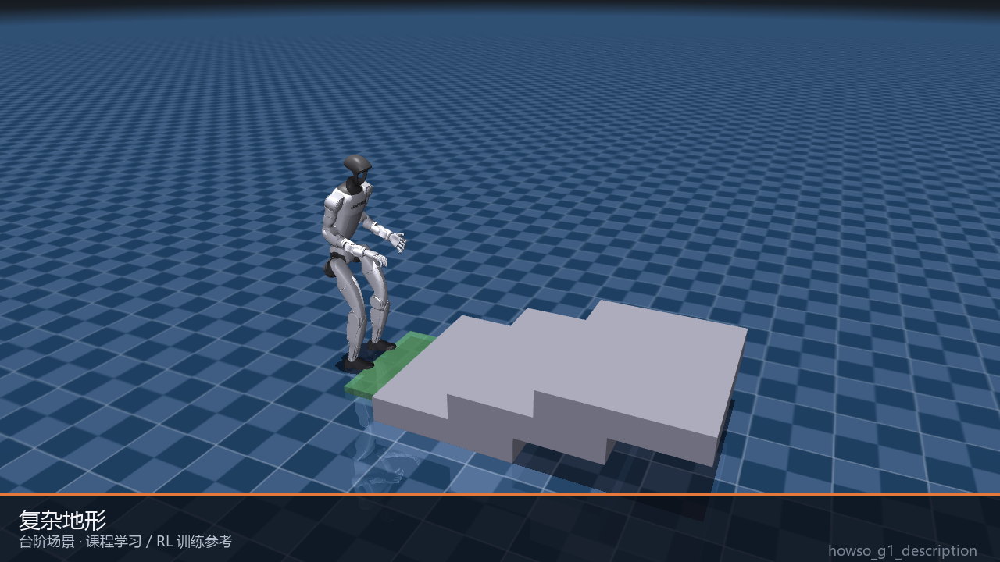
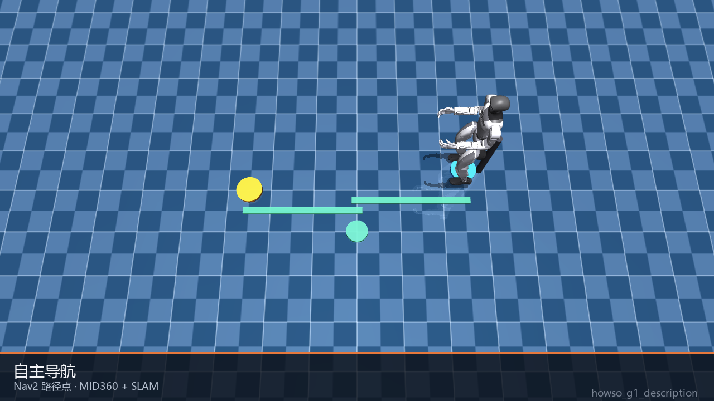
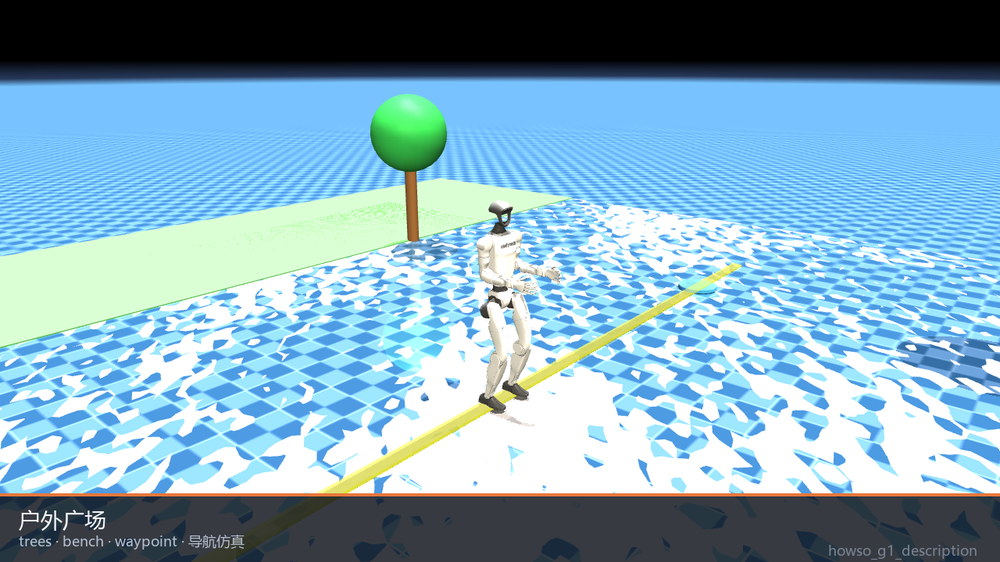
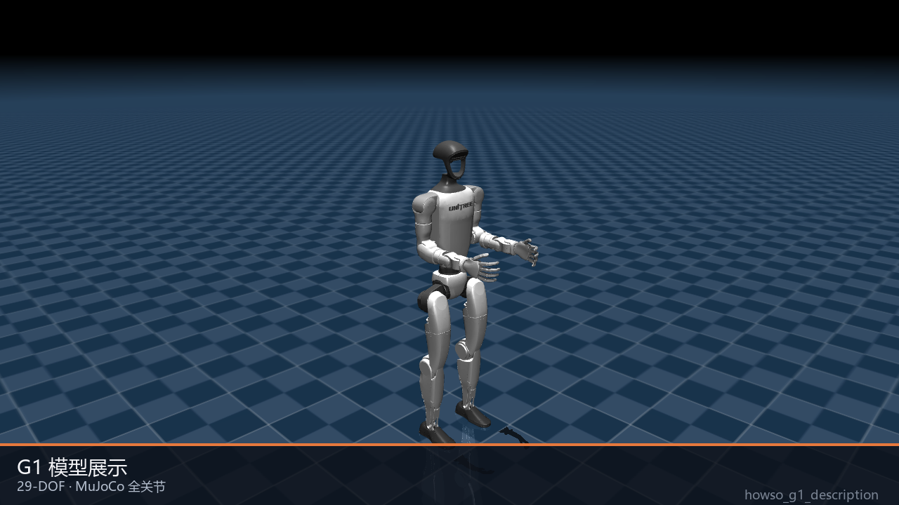

# 华苏机器人仿真平台

华苏机器人仿真平台面向机器人在虚拟场景中的模型展示、运动仿真、主控采集、场景标注和自主导航算法评估。平台以机器人仿真为核心，将前端可视化、后端数据管理和导航算法模块组织在同一工程中，便于后续开展多场景仿真验证与集成设计。

## 机器人仿真能力

| 能力 | 说明 |
|------|------|
| 机器人模型仿真 | 支持机器人基础模型、姿态、缩放和多构型效果展示。 |
| 场景化仿真 | 支持展厅、户外、复杂地形、多对象交互等典型仿真场景展示。 |
| 主控采集 | 支持查看机器人仿真过程中的采集状态、通信频率、电量状态和控制信息。 |
| 场景标注 | 支持围绕仿真场景对象、任务区域和交互目标进行数据管理与标注。 |
| 导航算法评估 | 集成路径规划、轨迹跟踪和代价地图相关源码，为自主导航仿真评估提供参考。 |

## 仿真场景展示

以下图片展示机器人在模型查看、主控采集、移动操作、展厅导览、复杂地形和自主导航等不同场景下的仿真效果。

| 模型展示 | 主控采集 | 多对象交互 |
|---|---|---|
|  |  |  |
| 展示机器人基础模型结构、姿态和缩放效果。 | 展示主控面板中的采集状态、通信频率和控制信息。 | 展示虚拟对象与操作界面下的多任务交互流程。 |

| 移动操作 | 展厅导览 | 复杂地形 |
|---|---|---|
|  |  |  |
| 展示机器人在任务空间中的移动与操作流程。 | 展示机器人在展厅场景中的导览和路径执行效果。 | 展示机器人在台阶、坡面等复杂地形中的运动仿真。 |

| 自主导航 | 户外场景 | 基础模型 |
|---|---|---|
|  |  |  |
| 展示目标点导航与路径跟踪效果。 | 展示机器人在室外环境中的仿真运行效果。 | 展示 G1 机器人基础构型和仿真姿态。 |

---

## 仿真工作流

| 阶段 | 内容 |
|------|------|
| 模型准备 | 导入机器人模型、配置仿真场景和基础运行参数。 |
| 场景运行 | 在展厅、户外、复杂地形等环境中运行机器人仿真任务。 |
| 数据采集 | 记录仿真过程中的状态、通信、控制和任务执行数据。 |
| 场景标注 | 对仿真对象、任务区域、目标点和交互行为进行标注管理。 |
| 算法评估 | 结合导航算法模块验证路径规划、轨迹跟踪和避障效果。 |

---

## 项目结构

| 目录 | 说明 |
|------|------|
| `embodied-collect-frontend` | 机器人仿真平台前端，用于场景展示、任务操作和数据查看。 |
| `embodied-collect-backend` | 后端服务，提供用户、数据、任务和平台接口管理。 |
| `algorithms/howso_navigation_algorithms` | 华苏导航算法模块，用于机器人自主导航仿真评估与集成参考。 |
| `photo` | 平台运行截图和仿真场景图片。 |
| `docs/assets` | 机器人模型、环境和导航仿真预览图。 |

---

## 环境要求

| 依赖 | 版本 |
|------|------|
| Python | 3.10+ |
| Node.js | 18+ |
| MySQL | 8.0 |
| Redis | 7+ |

---

## 机器人导航算法仿真模块（华苏导航算法）

项目已在 `algorithms/howso_navigation_algorithms` 中加入华苏导航算法模块，用于机器人自主导航仿真中的算法评估和后续集成设计。

当前包含 Smac Planner、Theta*、NavFn、MPPI Controller、Regulated Pure Pursuit Controller、Costmap 2D 以及相关接口与消息包。详细说明见 `algorithms/howso_navigation_algorithms/README.md`。

---

## 后端启动

### 1. 进入后端目录

```bash
cd embodied-collect-backend
```

### 2. 安装依赖

```bash
pip install -r requirements.txt
```

### 3. 配置环境变量

```bash
cp .env.example .env
```

按需修改 `.env` 中的数据库连接信息：

```env
MYSQL_HOST=127.0.0.1
MYSQL_PORT=3306
MYSQL_USER=root
MYSQL_PASSWORD=123456
MYSQL_DB=embodied_collect
REDIS_URL=redis://127.0.0.1:6379/0
```

### 4. 初始化数据库

确保 MySQL 已启动，并执行初始化 SQL：

```bash
mysql -u root -p embodied_collect < ../init.sql
```

### 5. 启动后端服务

**Windows (PowerShell)：**
```powershell
$env:PYTHONPATH = "."; python -m uvicorn main:app --host 0.0.0.0 --port 8000 --reload
```

**Linux / macOS：**
```bash
PYTHONPATH=. python -m uvicorn main:app --host 0.0.0.0 --port 8000 --reload
```

启动成功后访问：
- API 服务：http://localhost:8000
- 接口文档：http://localhost:8000/docs

### 默认账号

| 用户名 | 密码 |
|--------|------|
| admin | admin123 |

---

## 前端启动

### 1. 进入前端目录

```bash
cd embodied-collect-frontend
```

### 2. 安装依赖

```bash
npm install
```

### 3. 配置后端地址

编辑 `.env.development`，将后端地址改为实际 IP：

```env
VITE_API_BASE_URL=http://192.168.0.157:8000
```

### 4. 启动开发服务器

```bash
npm run dev
```

启动成功后访问：http://localhost:5173

---

## 同时启动前后端（快速启动）

打开两个终端分别执行：

**终端 1（后端）：**
```powershell
cd embodied-collect-backend
$env:PYTHONPATH = "."; python -m uvicorn main:app --host 0.0.0.0 --port 8000 --reload
```

**终端 2（前端）：**
```bash
cd embodied-collect-frontend
npm run dev
```

---

## 常见问题

**Q：登录报 Network Error**  
A：后端未启动，或 `.env.development` 中的 `VITE_API_BASE_URL` 地址不正确。

**Q：登录报 password cannot be longer than 72 bytes**  
A：bcrypt 版本不兼容，执行 `pip install bcrypt==4.0.1` 后重启后端。

**Q：数据库连接失败**  
A：检查 MySQL 是否启动，`.env` 中的用户名密码是否正确。
